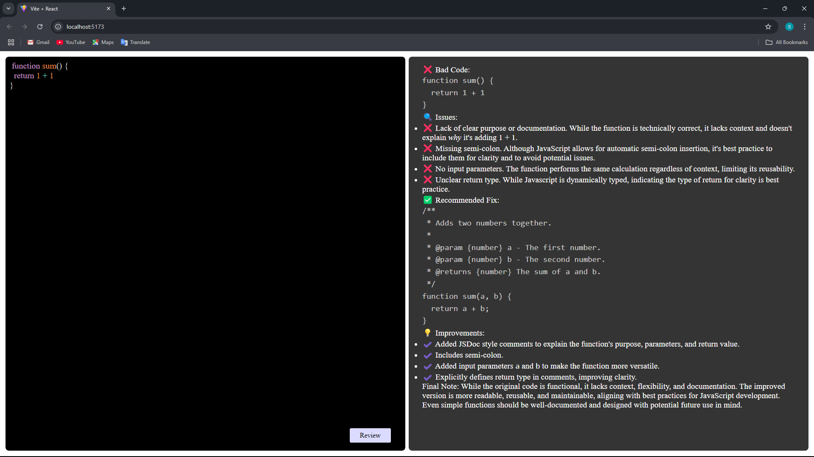

# 🧠 AI-Powered Code Reviewer

An intelligent and efficient AI-powered code review tool that analyzes source code and provides smart suggestions to improve code quality, performance, readability, and adherence to best practices. Powered by Google Gemini API.

---

## 📦 Tech Stack

### Backend:

-  **Node.js**
-  **Express.js**
-  **Google GenAI SDK (Gemini)**

### Frontend:

-  **React.js**
-  **CSS**

---

## 🚀 Features

- ✅ Accepts code input and reviews it using Gemini AI
- 🔍 Highlights issues and bad practices
- 💡 Provides better alternatives with explanations
- 📝 Suggests improved code and documents it
- ⚡ Lightweight and fast integration

---

## 🛠️ Setup Instructions

1. **Clone the repository:**
    ```bash
    git clone https://github.com/Smit-Halvadiya/Code-Reviewer.git
    ```

2. **Navigate to the project directory:**
    ```bash
    cd ai-code-reviewer
    ```

3. **Setup Environment:**

   Create a `.env` file in the `Backend/` directory:
    ```env
    GOOGLE_GEMINI_KEY=your_google_api_key
    ```

4. **Install dependencies:**

   - For Backend:
     ```bash
     cd Backend
     npm install
     ```

   - For Frontend:
     ```bash
     cd ../Frontend
     npm install
     ```

5. **Run the application:**

   - Start Backend:
     ```bash
     cd Backend
     npm run dev
     ```

   - Start Frontend (in a separate terminal):
     ```bash
     cd Frontend
     npm run dev
     ```

---

## 🧠 How it Works

1. User pastes code in the frontend UI.
2. The code is sent to the backend server.
3. Gemini API analyzes the code based on the system prompt (Senior Code Reviewer logic).
4. Review with issues, suggestions, improved version, and tips is returned.
5. The frontend displays the review in a formatted and styled UI.

---

## 🔐 Environment Variables

| Variable            | Description                                  |
|---------------------|----------------------------------------------|
| `GOOGLE_GEMINI_KEY` | Your API key for Google Gemini GenAI         |

---

## 📁 Project Structure

### Backend
Backend

├── controllers
├── services
├── routes
├── utils
└── server.js

### Frontend
Frontend

├── components
├── pages
├── App.css
├── App.jsx
└── main.jsx


---

## 📸 Screenshots



---

## 🤝 Contributing

Pull requests are welcome. For major changes, please open an issue first to discuss what you would like to change.

---

## 📄 License

This project is open source and available under the MIT License.

---

## 🙏 Acknowledgements

- Google GenAI SDK
- Gemini LLM by Google
- Inspiration from AI Copilots

---

## 💬 Feedback

If you have feedback or suggestions, feel free to open an issue or reach out.

---

Made with ❤️ by Smit

